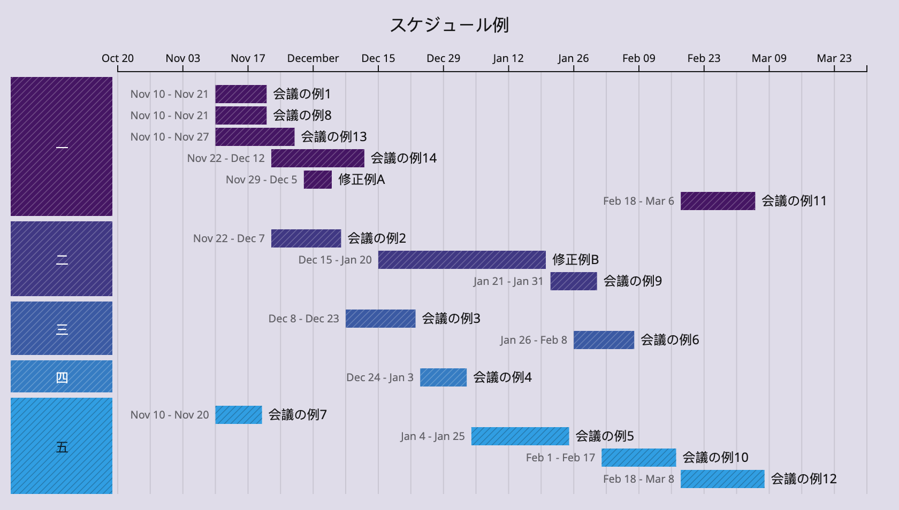

# Gantt Chart Auto-scheduling Tool
A simple, free (MIT), offline tool to autoschedule timelines completely in the browser. Optimization uses WebAssembly.

### Features
* Define timelines in a JSON DSL ([schema](https://github.com/garyg1/gantt-chart-tool/blob/main/schema.json)).
* Automatically schedule timelines based on task estimates and dependencies. The optimization runs locally in the browser via Microsoft Z3 Theorem Prover.
* Optional Google Fonts integration - use Google Fonts by specifying `googleFont`. Confirmation popup before making any external network calls. This feature is entirely optional.

### Supported Browsers
* Chrome latest
* Firefox latest (best effort)

### Licensing
MIT

# User Documentation
### Task Scheduling Definition
* Tasks are grouped into "swimlanes", which have fixed work bandwidth.
* Tasks can either have a `duration` or an `interval` (a fixed time they are executed).
* Tasks can have `deps` -- they will only by scheduled after all their `deps` are complete.

The following is a simple example timeline. We declare 3 swimlanes with different parallelism.
```json
{
    "swimlanes": [
        { "id": "1", "name": "A", "maxParallelism": 3 },
        { "id": "2", "name": "B", "maxParallelism": 2 },
        { "id": "3", "name": "C", "maxParallelism": 1 }
    ]
}
```

We declare 5 tasks.
```json
{
    "tasks": [
        {
            "name": "Task 1",
            "swimlaneId": "1",
            "duration": "P10D"
        },
        {
            "name": "Task 2",
            "swimlaneId": "2",
            "duration": "P20D",
            "deps": ["Task 1"]
        },
        {
            "name": "Fixed Task A",
            "swimlaneId": "2",
            "interval": {
                "start": "2024-11-20",
                "end": "2024-12-01"
            }
        },
        {
            "name": "Task 3",
            "swimlaneId": "3",
            "duration": "P10D",
            "deps": ["Task 2", "Fixed Task A"]
        },
        {
            "name": "Task 4",
            "swimlaneId": "3",
            "duration": "P10D",
            "deps": ["Fixed Task A"]
        }
    ]
}
```


The scheduler finds the optimal solution. Notice that Task 4 must wait on Task 3 to complete due to swimlane C's `maxParallelism` constraint.

If we instead allocate bandwidth from swimlane "B" -> "C", the optimal solution changes.
```json
{
    "swimlanes": [
        { "id": "1", "name": "A", "maxParallelism": 3 },
        { "id": "2", "name": "B", "maxParallelism": 1 },
        { "id": "3", "name": "C", "maxParallelism": 2 }
    ]
}
```


Although Task 4 is not blocked by Task 3, Task 2 must now wait on Fixed Task A. The resulting solution is less optimal (Jan 2 vs. Dec 28 completion). Exploring headcount allocation scenarios in real time is one of the applications of this tool.

The below solution is a medium size instance solved by the tool where the solution is provably optimal. The critical path is highlighted in black.


No amount of additional resources will accelerate the May 30 completion. In fact, the allocation can be reduced by 1 in swimlane A and achieve the same result.


### Usage and Styling Examples
The below examples are timelines scheduled and rendered by the tool. The sample project contains a graph of interdependent tasks. Some tasks are given fixed dates using `interval`. Dependencies can cross workgroup/swimlane boundaries.


[docs/examples/Basic-Example.json](docs/examples/Basic-Example.json) (Font: Atkinson Hyperlegible)


[docs/examples/Dark-Example.json](docs/examples/Dark-Example.json) (Font: Space Grotesk)

This tool aims to be simple and customizable. A variety of styling options are supported.


[docs/examples/Colorful-Example.json](docs/examples/Colorful-Example.json) (Font: Atkinson Hyperlegible)


[docs/examples/Yarndings-20-Example.json](docs/examples/Yarndings-20-Example.json) (Font: Yarndings 20)

Unicode is fully supported and the tool makes few assumptions about localization.


[docs/examples/Noto-Sans-Example.json](docs/examples/Noto-Sans-Example.json) (Font: Noto Sans Japanese)

# Design Discussion

### Dependencies
This repo is self-contained. Dependencies are Microsoft Z3 Prover WASM (MIT), D3.js (ISC), and Monaco editor (MIT). We used the approach found in [this CodePen](https://codepen.io/jey/pen/nOEeME) to structure the SVG.

### Comparison with other free tools
There are a lot of excellent free tools to render Gantt charts via a DSL (but not necessarily to schedule them).
- [Vega implementation](https://github.com/PBI-David/Deneb-Showcase) (David Bacci)
- [PlantUML](https://plantuml.com/gantt-diagram)

A commercial tool in this area is [Microsoft Project](https://en.wikipedia.org/wiki/Microsoft_Project).

The choice to create our own simple JSON DSL to model the timeline rather than build on top of an existing graphics definition language (e.g., Vega, PlantUML) was deliberate -- since this tool doesn't try to fit into a larger framework or abstraction layer, the timeline JSONs are simple, easily parsable and programmable, which is what this tool tries to achieve.

### Optional Google Fonts Integration
A confirmation popup is displayed before this tool makes any external network calls (Google Fonts). The Google Fonts feature is entirely optional - you can use system fonts offline.


